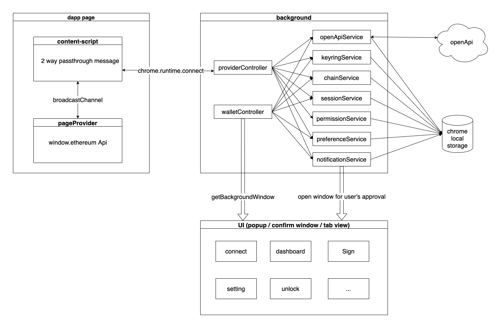

# DeFiNexus
DeFiNexus is next generation wallet for DeFi

## Contribution

### Install dependency

1. Install Node.js version 14 or later
2. Install Yarn `npm install -g yarn`
3. Run `yarn` to install dependency

### Development

Run `yarn build:dev` to develop with file watching and development log(you can see request sent by dapp in website console in this mode and notification will not close when focus lost)

Run `yarn build:pro` to build a production package, it's in dist folder

### Language

1. Copy `_raw/_locales/en/messages.json` to `_raw/_locales/${localCode}/messages.json` (Find your locale code in [https://en.wikipedia.org/wiki/Language_localisation#Language_tags_and_codes](https://en.wikipedia.org/wiki/Language_localisation#Language_tags_and_codes))
2. Replace content in `message` property to your locale language

ATTENTION: When you create a new key, make sure the key should without space and not duplicate with exist(case insensitive)

## Architecture

## Extension's scripts

below 4 scripts all live in different context!

### **- `background.js`**

for all async request and encrypt things.

user's keyrings, password and wallet personal preference data all stored in chrome local storage.

it has 2 main controllers:

1. `walletController`

   it expose methods to background window, so other scripts can access these methods with `runtime.getBackgroundPage`, e.g. `ui.js`.

2. `providerController`

   it handles request from pages(dapp request).
   
### **- `content-script`**
the main purpose is inject `pageProvider.js` and pass messages between `pageProvider.js` and `background.js`.
